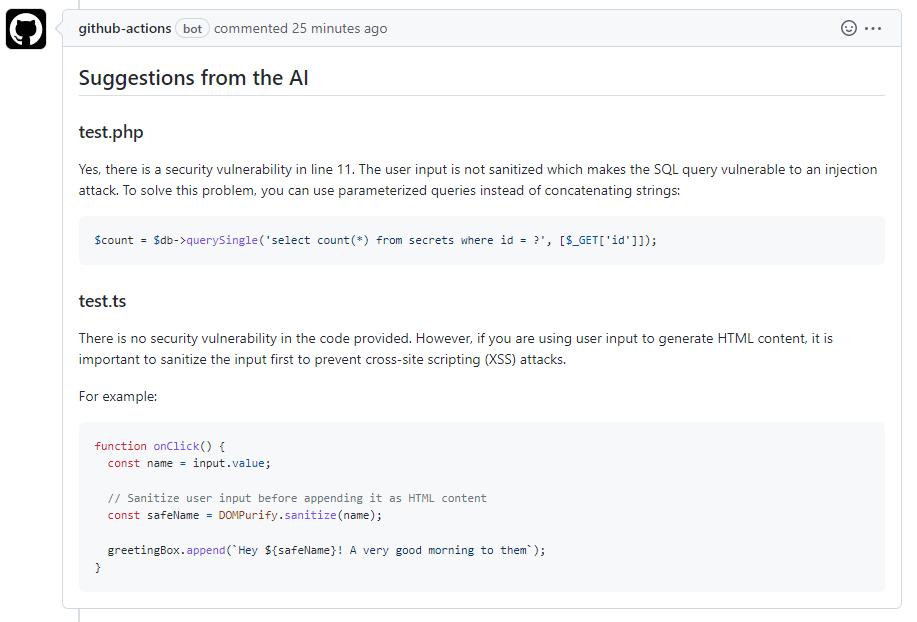

> **Warning**
> This GitHub action it is not recommended for production environments. It's only a PoC to test OpenAI.

> **Warning**
> This GitHub action sends the code to OpenAI.
# openai-security-review

GitHub action to get security recommendations from OpenAI.

- The action is triggered when a PR is opened or updated.
- The action retrieves the files with changes in the PR and passes them to the OpenAI API.
- The OpenAI API analyzes the code and generates a security recommendation.
- The action adds a comment in the PR with the security recommendation from OpenAI.

## Usage
### Inputs
* `openai-token` - Your secret API key from OpenAI
* `tokens` - The maximum number of [tokens](https://beta.openai.com/tokenizer) to generate in the completion.
* `max-files` - The maximum number of files to review

### Example workflow
```
name: Get OpenAI recommendation
on:
  pull_request:
    branches: [ "main" ]

jobs:
  get-recommendation:
    runs-on: ubuntu-latest
    name: Get a recommendation from OpenAI
    steps:
      - name: Checkout
        uses: actions/checkout@v2
        with:
          fetch-depth: 2
      - name: Get AI comment
        uses: adanalvarez/openai-security-review@v0
        with:
          openai-token: ${{ secrets.OPENAI_TOKEN }}
          tokens: 2500
          max-files: 5
```
> **Note**
> You must use `actions/checkout` before the openai-security-review step. If you use `actions/checkout@v2`, you must specify a commit depth other than the default, which is 1—using a fetch-depth of '0' clones the entire history. If you want to do a more efficient clone, use '2', which is not guaranteed to work with pull requests.

### Example PR comment

   
